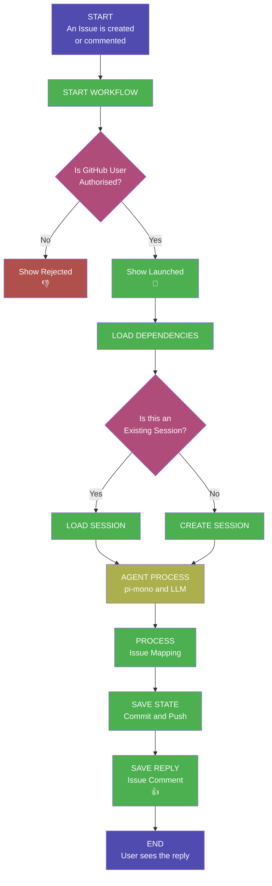

# GitHub Minimum Intelligence

A repository-local AI framework that plugs into a developer’s existing workflow. Instead of external chat tools, it uses GitHub Issues for conversation, Git for persistent versioned memory, and GitHub Actions for execution. Installed by adding one folder to a repo, it delivers low-infrastructure, auditable, user-owned automation by committing every prompt/response and code change to the codebase.

### Please read [this](docs/final-warning.md) before you install this AI Agent.

## Installation

1. Copy [`.github/workflows/ghapi.yml`](../.github/workflows/ghapi.yml) into your repo's `.github/workflows/` directory.
2. Add the LLM API key `OPENAI_API_KEY` as a **repository secret** under **[Settings → Secrets and variables → Actions]**. Any [supported LLM provider](#supported-providers) can work but to quick start OpenAI GPT 5.4 is pre-configured.
3. Go to **[Actions → ghapi → Run workflow]** to install the agent files automatically, subsequent runs perform upgrades.
4. Open an issue — the agent will reply.
<p align="center">
  <picture>
    
  </picture>
</p>

## An AI agent that lives in your GitHub Repo

[](https://opensource.org/licenses/MIT)  [](https://github.com/japer-technology/github-minimum-intelligence/actions/workflows/ghapi.yml)

Powered by [pi-mono](https://github.com/badlogic/pi-mono), conversation history is committed to git, giving your agent long-term memory across sessions. It can search prior context, edit or summarize past conversations, and all changes are versioned.

---

## Your Data, Your Environment

With a typical LLM, a developer constantly moves between their repository and someone else’s interface. They ask the model to explain code, trace bugs, suggest refactors, write tests, draft documentation, or plan changes, but each prompt and response lives outside the repo itself. Code is copied out of chat windows and pasted back into editors, while the reasoning, decisions, and project-specific knowledge built along the way end up scattered across browser tabs, chat histories, and third-party platforms instead of being preserved with the code.

**Minimum Intelligence flips that model.** Every prompt you write and every response the agent produces is committed directly to your repository as part of its normal workflow. There is nothing to copy, nothing to paste, and nothing stored outside your control.

- **Ask a question** → the answer is already in your repo.
- **Request a file change** → the agent commits the edit for you.
- **Continue a conversation weeks later** → the full history is right there in git.

Your repository _is_ the AI workspace. The questions, the results, the code, the context - it all lives where your work already lives, versioned and searchable, owned entirely by you.

---

## Why GitHub Minimum Intelligence

| Capability | Why it matters |
|---|---|
| **Single workflow, any repo** | Add one workflow file, run it once, and the agent installs itself. Nothing to host or maintain. |
| **Zero infrastructure** | Runs on GitHub Actions with your repo as the only backend. |
| **Persistent memory** | Conversations are committed to git - the agent remembers everything across sessions. |
| **Full auditability** | Every interaction is versioned; review or roll back any change the agent made. |
| **Multi-provider LLM support** | Works with Anthropic, OpenAI, Google Gemini, xAI, DeepSeek, Mistral, Groq, and any OpenRouter model. |
| **Modular skill system** | Agent capabilities are self-contained Markdown files - user-extensible and composable. |

---

## How It Works

The entire system runs as a closed loop inside your GitHub repository. When you open an issue (or comment on one), a GitHub Actions workflow launches the AI agent, which reads your message, thinks, responds, and commits its work - all without leaving GitHub.



A technical framework designed to integrate a repository-local AI agent directly into a developer's existing workflow. Unlike external chat platforms, this system uses GitHub Issues as a conversational interface and leverages Git as a persistent memory bank, ensuring all interactions and code changes are versioned and owned by the user. Operating entirely through GitHub Actions, the tool provides a low-infrastructure solution that can be installed by adding a single folder to any repository. The project emphasizes full auditability and data sovereignty by committing every prompt and response to the codebase, allowing the agent to perform tasks such as editing files and summarizing long-term project history.
### Key Concepts

| Concept | Description |
|---|---|
| **Issue = Conversation** | Each GitHub issue maps to a persistent AI conversation. Comment again to continue where you left off. |
| **Git = Memory** | Session transcripts are committed to the repo. The agent has full recall of every prior exchange. |
| **Actions = Runtime** | GitHub Actions is the only compute layer. No servers, no containers, no external services. |
| **Repo = Storage** | All state - sessions, mappings, and agent edits - lives in the repository itself. |

### State Management

All state lives in the repo:

```
.ghapi/state/
  issues/
    1.json          # maps issue #1 → its session file
  sessions/
    2026-02-04T..._abc123.jsonl    # full conversation for issue #1
```

Each issue number is a stable conversation key - `issue #N` → `state/issues/N.json` → `state/sessions/<session>.jsonl`. When you comment on an issue weeks later, the agent loads that linked session and continues. No database, no session cookies - just git.

---

## Prerequisites

- A GitHub repository (new or existing)
- An API key from your chosen LLM provider (see [Supported providers](#supported-providers) below)

---

## Add Your API Key

In your GitHub repo, go to **Settings → Secrets and variables → Actions** and create a secret for your chosen provider:

| Provider | Secret name | Where to get it |
|----------|------------|-----------------|
| Anthropic | `ANTHROPIC_API_KEY` | [console.anthropic.com](https://console.anthropic.com/) |
| OpenAI | `OPENAI_API_KEY` | [platform.openai.com](https://platform.openai.com/) |
| Google Gemini | `GEMINI_API_KEY` | [aistudio.google.com](https://aistudio.google.com/) |
| xAI (Grok) | `XAI_API_KEY` | [console.x.ai](https://console.x.ai/) |
| DeepSeek (via OpenRouter) | `OPENROUTER_API_KEY` | [openrouter.ai](https://openrouter.ai/) |
| Mistral | `MISTRAL_API_KEY` | [console.mistral.ai](https://console.mistral.ai/) |
| Groq | `GROQ_API_KEY` | [console.groq.com](https://console.groq.com/) |

---

## What Happens When You Open an Issue

```
You open an issue
    → GitHub Actions triggers the agent workflow
    → The agent reads your issue, thinks, and responds
    → Its reply appears as a comment (🚀 shows while it's working, 👍 on success)
    → The conversation is saved to git for future context
```

Comment on the same issue to continue the conversation. The agent picks up where it left off.

---

## Hatching - Give the Agent a Personality

Use the **🥚 Hatch** issue template (or create an issue with the `hatch` label) to go through a guided conversation where you and the agent figure out its name, personality, and vibe together.

This is optional. The agent works without hatching, but it's more fun with a personality.

---

## Project Structure

```
.ghapi/
  .pi/                              # Agent personality & skills config
    settings.json                   # LLM provider, model, and thinking level
    APPEND_SYSTEM.md                # System prompt loaded every session
    BOOTSTRAP.md                    # First-run identity prompt
    skills/                         # Modular skill packages
  install/
    GHAPI-AGENTS.md               # Default agent identity template (copied to AGENTS.md on install)
    settings.json                                # Default LLM settings template (copied to .pi/settings.json on install)
  lifecycle/
    agent.ts                # Core agent orchestrator
  docs/                             # Documentation and analysis
  public-fabric/                    # GitHub Pages static site
  state/                            # Session history and issue mappings (git-tracked)
  logo.png                          # Agent logo
  AGENTS.md                         # Agent identity file
  VERSION                           # Installed version
  package.json                      # Runtime dependencies
```

---

## Configuration

**Change the model** - edit `.ghapi/.pi/settings.json`:

<details>
<summary><strong>OpenAI - GPT-5.4 (default)</strong></summary>

```json
{
  "defaultProvider": "openai",
  "defaultModel": "gpt-5.4",
  "defaultThinkingLevel": "high"
}
```

Requires `OPENAI_API_KEY`.
</details>

<details>
<summary><strong>Anthropic</strong></summary>

```json
{
  "defaultProvider": "anthropic",
  "defaultModel": "claude-opus-4-6",
  "defaultThinkingLevel": "high"
}
```

Requires `ANTHROPIC_API_KEY`.
</details>

<details>
<summary><strong>OpenAI - GPT-5.3 Codex Spark</strong></summary>

```json
{
  "defaultProvider": "openai",
  "defaultModel": "gpt-5.3-codex-spark",
  "defaultThinkingLevel": "medium"
}
```

Requires `OPENAI_API_KEY`.
</details>

<details>
<summary><strong>DeepSeek (via OpenRouter)</strong></summary>

```json
{
  "defaultProvider": "openrouter",
  "defaultModel": "deepseek/deepseek-r1",
  "defaultThinkingLevel": "medium"
}
```

Requires `OPENROUTER_API_KEY`.
</details>

<details>
<summary><strong>xAI - Grok</strong></summary>

```json
{
  "defaultProvider": "xai",
  "defaultModel": "grok-3",
  "defaultThinkingLevel": "medium"
}
```

Requires `XAI_API_KEY`.
</details>

<details>
<summary><strong>Google Gemini - gemini-2.5-pro</strong></summary>

```json
{
  "defaultProvider": "google",
  "defaultModel": "gemini-2.5-pro",
  "defaultThinkingLevel": "medium"
}
```

Requires `GEMINI_API_KEY`.
</details>

<details>
<summary><strong>Google Gemini - gemini-2.5-flash</strong></summary>

```json
{
  "defaultProvider": "google",
  "defaultModel": "gemini-2.5-flash",
  "defaultThinkingLevel": "medium"
}
```

Requires `GEMINI_API_KEY`. Faster and cheaper than gemini-2.5-pro.
</details>

<details>
<summary><strong>xAI - Grok Mini</strong></summary>

```json
{
  "defaultProvider": "xai",
  "defaultModel": "grok-3-mini",
  "defaultThinkingLevel": "medium"
}
```

Requires `XAI_API_KEY`. Lighter version of Grok 3.
</details>

<details>
<summary><strong>DeepSeek Chat (via OpenRouter)</strong></summary>

```json
{
  "defaultProvider": "openrouter",
  "defaultModel": "deepseek/deepseek-chat",
  "defaultThinkingLevel": "medium"
}
```

Requires `OPENROUTER_API_KEY`.
</details>

<details>
<summary><strong>Mistral</strong></summary>

```json
{
  "defaultProvider": "mistral",
  "defaultModel": "mistral-large-latest",
  "defaultThinkingLevel": "medium"
}
```

Requires `MISTRAL_API_KEY`.
</details>

<details>
<summary><strong>Groq</strong></summary>

```json
{
  "defaultProvider": "groq",
  "defaultModel": "deepseek-r1-distill-llama-70b",
  "defaultThinkingLevel": "medium"
}
```

Requires `GROQ_API_KEY`.
</details>

<details>
<summary><strong>OpenRouter (any model)</strong></summary>

```json
{
  "defaultProvider": "openrouter",
  "defaultModel": "your-chosen-model",
  "defaultThinkingLevel": "medium"
}
```

Requires `OPENROUTER_API_KEY`. Browse available models at [openrouter.ai](https://openrouter.ai/).
</details>

**Make it read-only** - add `--tools read,grep,find,ls` to the agent args in `lifecycle/agent.ts`.

**Filter by label** - edit `.github/workflows/ghapi.yml` to only trigger on issues with a specific label.

**Adjust thinking level** - set `defaultThinkingLevel` to `"low"`, `"medium"`, or `"high"` in `settings.json` for different task complexities.

---

## Supported Providers

`.pi` supports a wide range of LLM providers out of the box. Set `defaultProvider` and `defaultModel` in `.ghapi/.pi/settings.json` and add the matching API key to your workflow:

| Provider | `defaultProvider` | Example model | API key env var |
|----------|-------------------|---------------|-----------------|
| OpenAI | `openai` | `gpt-5.4` (default), `gpt-5.3-codex`, `gpt-5.3-codex-spark` | `OPENAI_API_KEY` |
| Anthropic | `anthropic` | `claude-sonnet-4-20250514` | `ANTHROPIC_API_KEY` |
| Google Gemini | `google` | `gemini-2.5-pro`, `gemini-2.5-flash` | `GEMINI_API_KEY` |
| xAI (Grok) | `xai` | `grok-3`, `grok-3-mini` | `XAI_API_KEY` |
| DeepSeek | `openrouter` | `deepseek/deepseek-r1`, `deepseek/deepseek-chat` | `OPENROUTER_API_KEY` |
| Mistral | `mistral` | `mistral-large-latest` | `MISTRAL_API_KEY` |
| Groq | `groq` | `deepseek-r1-distill-llama-70b` | `GROQ_API_KEY` |
| OpenRouter | `openrouter` | any model on [openrouter.ai](https://openrouter.ai/) | `OPENROUTER_API_KEY` |

> **Tip:** The `pi` agent supports many more providers and models. Run `pi --help` or see the [pi-mono docs](https://github.com/badlogic/pi-mono) for the full list.

---

## Security

The workflow only responds to repository **owners, members, and collaborators**. Random users cannot trigger the agent on public repos.

If you plan to use minimum-intelligence for anything private, **make the repo private**. Public repos mean your conversation history is visible to everyone, but get generous GitHub Actions usage.

---

## Repo Size

The repo is overwhelmingly dominated by node_modules (~99%). The actual project files (README, LICENSE, config, GitHub workflows, GMI state/lifecycle) are only about ~1 MB.

---

<p align="center">
  <picture>
    
  </picture>
</p>
